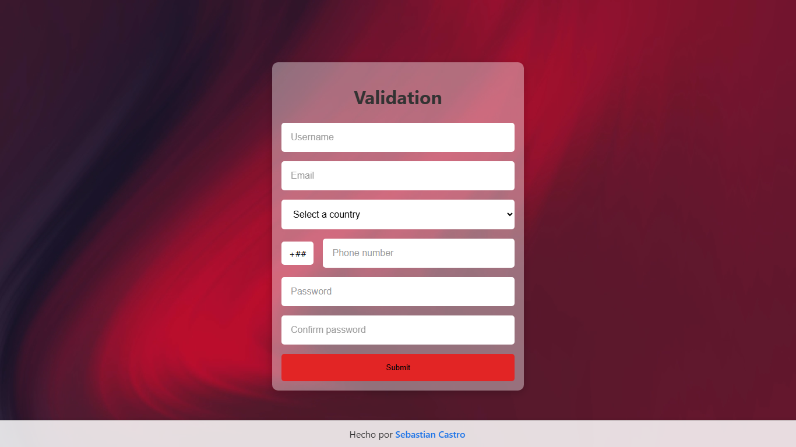

#  Proyecto validación de datos

Este es un proyecto de práctica desarrollado por un estudiante de programacion. Consiste en una página web interactiva que valida los datos de un usuario en tiempo real antes de permitir el envío de datos

##  Vista previa
La aplicación cuenta con una interfaz moderna con un fondo de video y un contenedor con efectos de transparencia

- **Usuario:** Validación de longitud (6-15 caracteres)
- **Email:** Comprobación de formato de correo válido
- **Teléfono:** Validación de caracteres numéricos
- **Contraseña:** Requisitos de seguridad (Mayúsculas, minúsculas y números)

##  Lenguajes utilizados 

* **HTML5:** Estructura semántica del formulario
* **CSS3:** * **Flexbox:** Utilizado para el diseño responsivo y la alineación del prefijo telefónico
    * **Diseño Moderno:** Uso de variables, transparencias y fondos de video
* **JavaScript (Vanilla):** Lógica de validación personalizada
